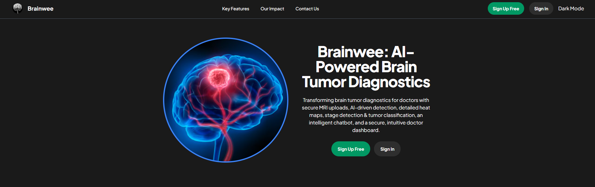
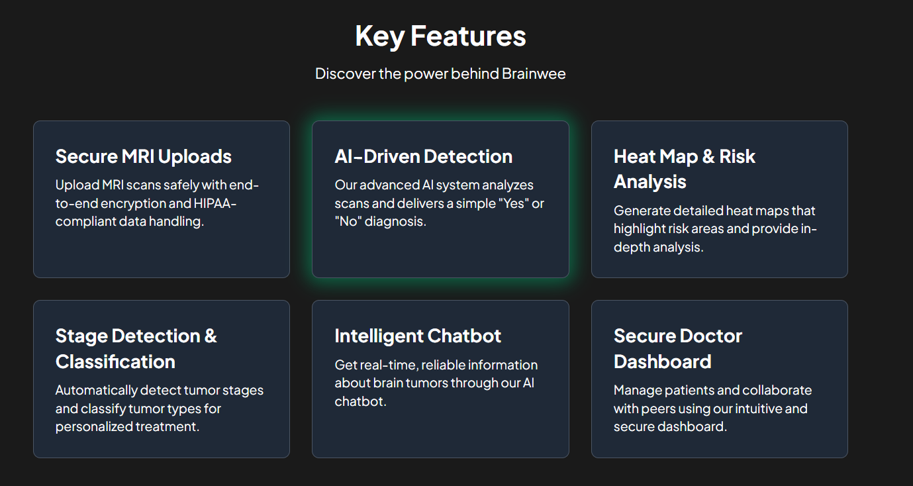
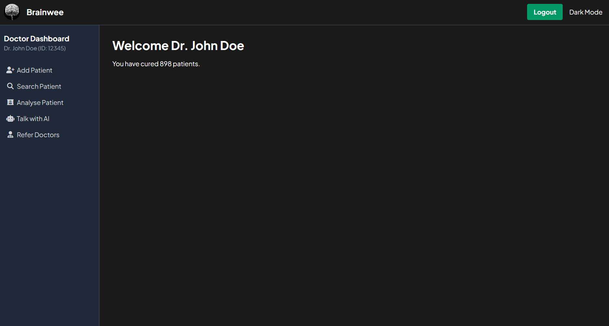
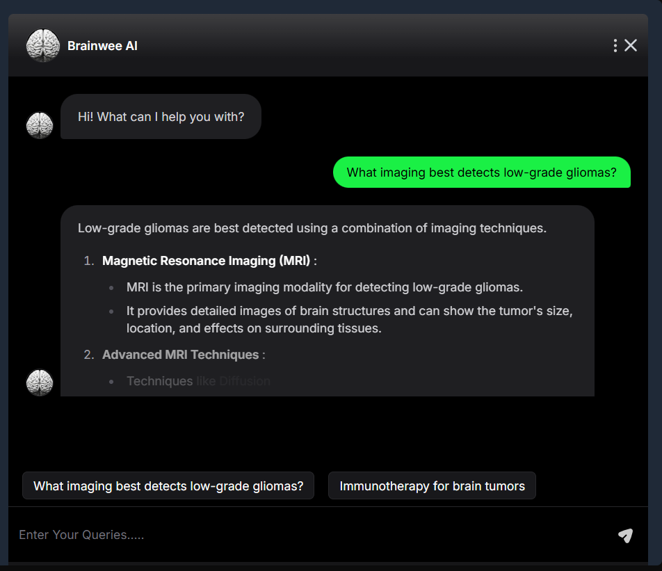

#  BRAINWEE By The Axios for - INNOVOCON 2k25

## 🏥 Brain Tumor Segmentation using Deep Learning

### 📌 Project Overview
This project focuses on detecting and segmenting brain tumors using deep learning models. The goal is to accurately predict tumor regions in MRI scans, refine the predicted masks, and visualize them effectively.

---
##  Our Deployed Model Preview
[Click Here to Check](https://huggingface.co/spaces/KIZERRRRRR/segmentation_tumor)


---
##  Our Deployed AI Support Preview
[Click Here to validate](https://www.chatbase.co/chatbot-iframe/17ne20jC-R2I_HYsJm9k1)


## 🚀 Features
- **Deep Learning Model**: Utilizes a CNN-based approach for brain tumor segmentation.
- **Preprocessing Pipeline**: Includes image resizing, normalization, and augmentation.
- **Post-processing**: Applies Gaussian smoothing and morphological operations to refine segmentation masks.
- **Visualization**: Displays predicted masks and overlays them on MRI images.
- **Web App**: Provides a simple UI for uploading and processing MRI scans.
---


##  Homepage Preview



---
##  Key  Features Preview



---
##  DashBoard Preview



---
##  Chat-Support Preview



---

## 📂 Folder Structure
```
├── models/              # Trained deep learning models
├── static/
│   ├── css/            # Stylesheets
│   ├── js/             # Frontend scripts
│   ├── heatmaps/       # Generated heatmaps
│   ├── images/         # UI images
├── templates/
│   ├── index.html      # Web interface
├── uploads/            # Uploaded MRI scans
├── app.py              # Main backend file (Flask-based)
├── requirements.txt    # Python dependencies
├── README.md           # Project documentation
```

---


### 📊 Performance Graphs
#### Segmentation Performance


#### Classification Performance


#### Confusion Matrix


#### Segmentation Results


---

## 🤖 Technologies Used
- **Python** (TensorFlow, OpenCV, NumPy, Matplotlib, Flask)
- **Deep Learning** (CNN-based segmentation model)
- **Frontend** (HTML, CSS, JavaScript,Tailwind CSS)

---

## 📌 Future Enhancements
- Improve model accuracy with a larger dataset.
- Deploy the model using cloud services (AWS/GCP).
- Build a real-time tumor detection system.

---

## 🏆 Contributors
- **Srinjoy Pramanik** - Backend Engineer
- **Rupkatha Sharma** - Machine Learning Expert
- **Syed Md Musharraf** - Deep Learning Engineer
- **Ayushi  Bose** - Frontend Contributor
- **Mayukh Bhowmik** - Frontend Engineer


---

## 📝 This Project is Specially Made For INNOVOCON @2025 By Team Axios
